# Shell scipting-onboarding new users

Create direcotry shell

`mkdir Shell`

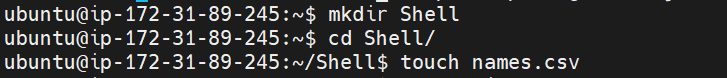

In shell directory, create a file names.csv 

`vim names.csv`

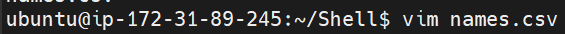

Add list of new users
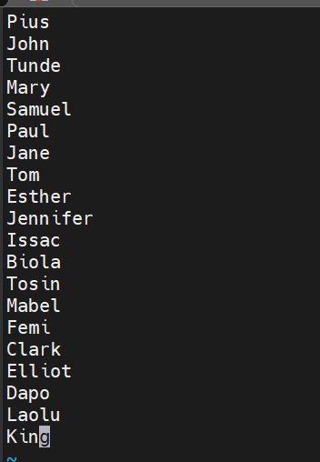

Create a group named developers

`sudo groupadd developers`

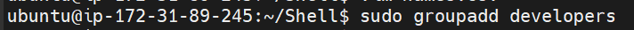

Create shell-script and add code

`vim onboard.sh`

make onboard.sh an executable 

`sudo chmod +x onboard.sh`

In .ssh directory, create a file id_rsa.pub

`vim id_rsa.pub`

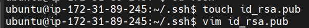

in .ssh directory, create a file id_rsa

`vim id_rsa`

run onboard.sh 

`./onboard.sh`

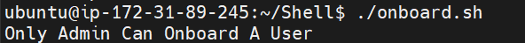

run onboard.sh in root user

`sudo su`

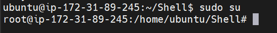

`sudo ./onboard.sh`

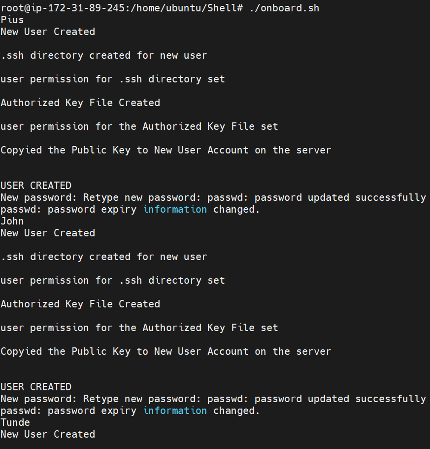

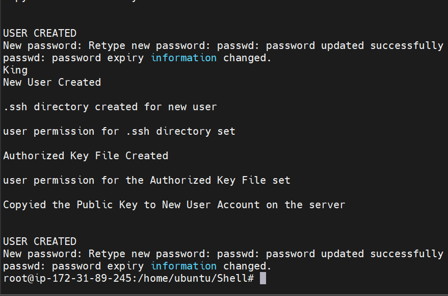

Check users created

`ls -l /home/  `
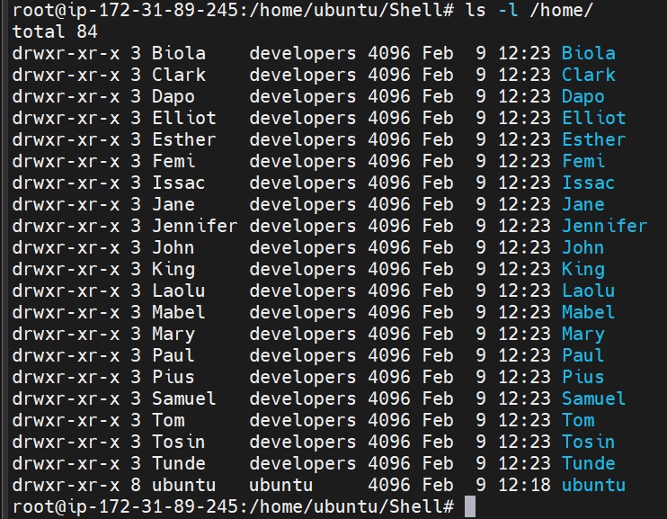

## connecting to user from a new terminal

create pem file

`vim auxproject.pem`

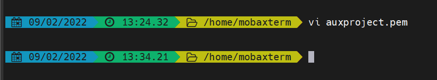

run ssh

`ssh -i auxproject.pem username@ip-addresss

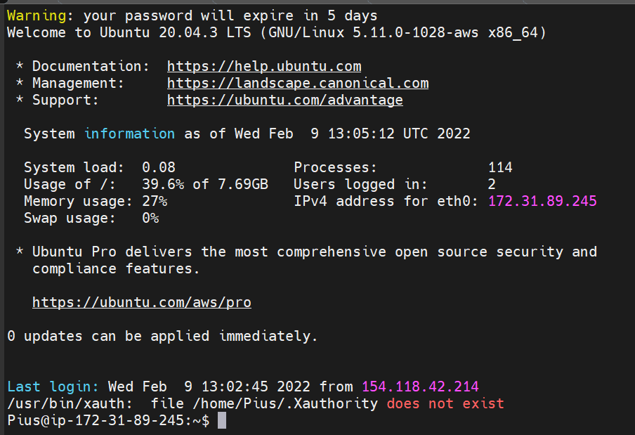